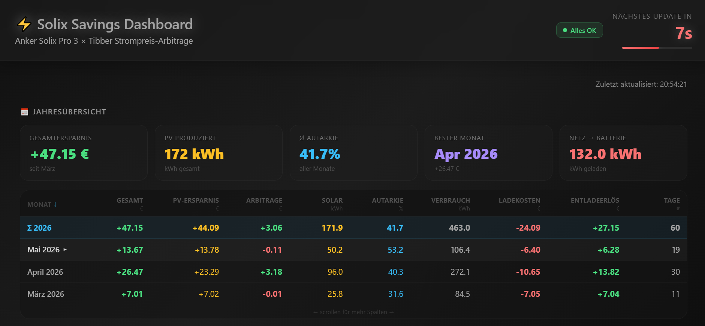
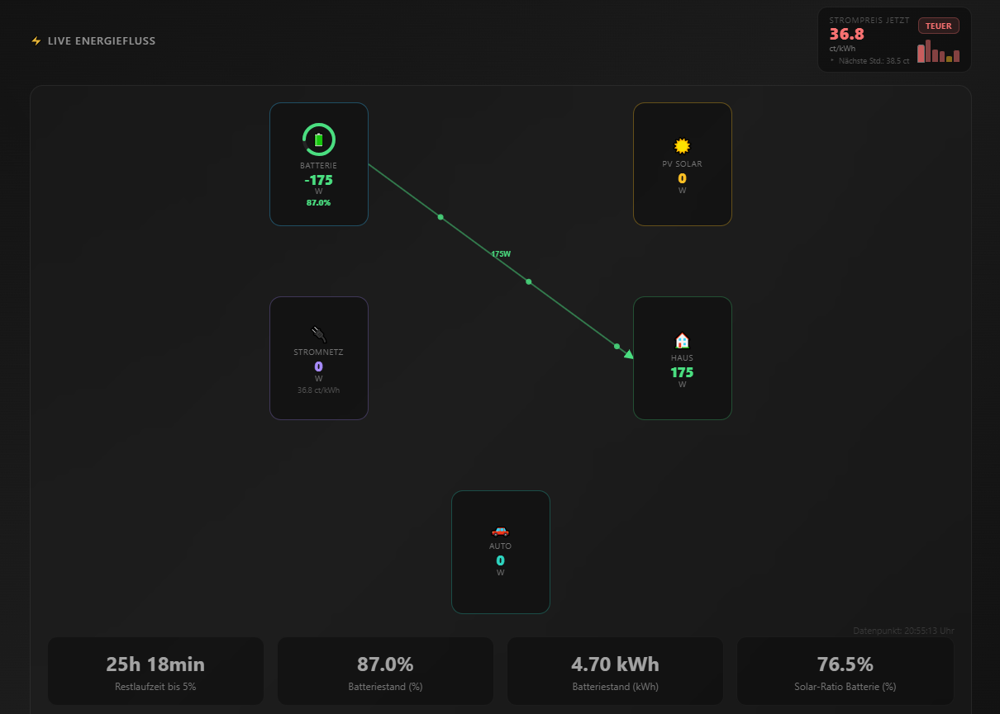
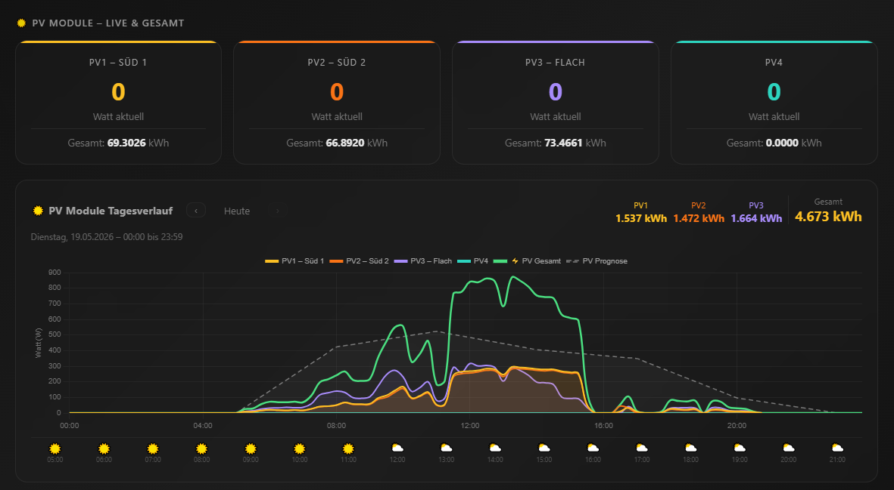
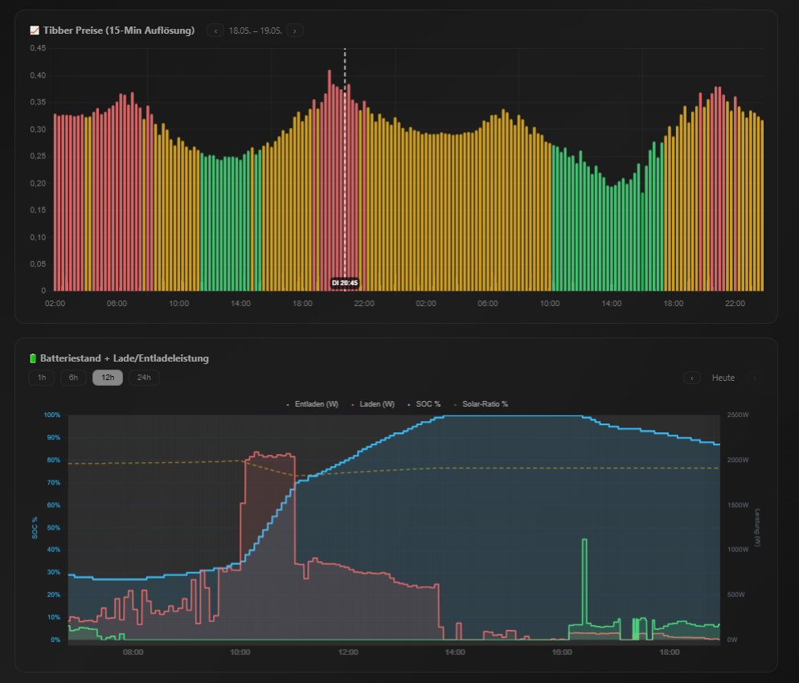
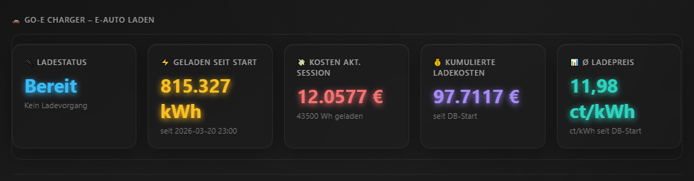
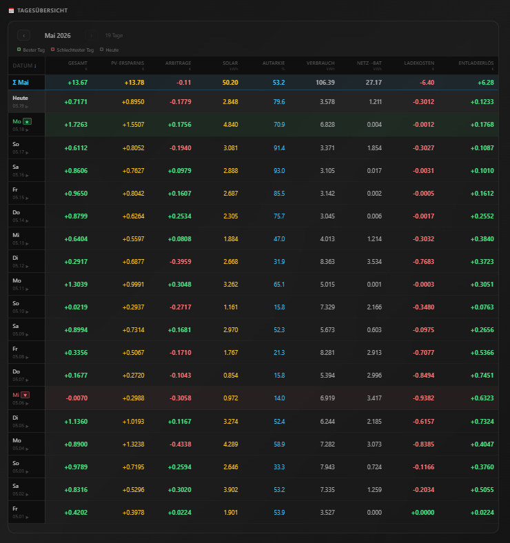

# Solix Savings Dashboard

A self-hosted energy monitoring dashboard for the **Anker SOLIX** home battery system combined with **Tibber** dynamic electricity pricing.

Tracks real-time energy flow, calculates grid arbitrage savings, and visualises solar self-consumption — all stored locally in SQLite.

  

---

## Screenshots

**Annual overview & monthly savings table**
Cumulative totals for savings, PV production, autarky, and grid-battery balance — with a per-day breakdown table showing best/worst day highlights.


**Live energy flow diagram**
Animated real-time view of power moving between PV, battery, grid, house, and EV charger. Shows current Tibber price and battery runtime estimate.


**PV module chart**
Per-string live output and daily totals for up to 4 PV strings, overlaid with a weather-based forecast curve and hourly weather icons.


**Tibber prices & battery SOC**
48-hour Tibber price chart (colour-coded cheap / normal / expensive) paired with a battery state-of-charge, charge, and discharge history chart.


**go-e charger panel**
EV charging stats: current session energy, session cost, cumulative energy since tracking start, and average charge price per kWh.


**Daily detail table**
Full month view with per-day columns for total savings, PV savings, arbitrage, solar yield, autarky %, household consumption, grid↔battery balance, and discharge revenue.


---

## Features

- **Live energy flow** — animated diagram showing PV → Battery → House → Car (go-e charger)
- **Tibber price arbitrage** — tracks savings from charging at cheap hours and discharging during expensive ones
- **Solar self-consumption** — calculates autarky percentage and PV savings
- **Battery composition tracking** — traces the solar/grid ratio inside the battery over time
- **Anomaly detection** — alerts for data gaps, missing Tibber prices, and battery composition glitches
- **Daily & monthly summaries** — historical table with best/worst day highlighting
- **PV forecast** — weather-based solar yield scoring
- **go-e charger integration** — separates car charging power from household consumption

---

## Architecture

```
main.py                  ← Async scheduler (collects data every 15s)
├── collector/
│   ├── anker_client.py  ← Anker SOLIX API
│   ├── tibber_client.py ← Tibber GraphQL API
│   ├── goe_client.py    ← go-e charger API
│   └── weather_client.py← PV forecast (weather API)
├── engine/
│   └── savings_calculator.py ← Arbitrage & savings logic
├── database/
│   └── db.py            ← SQLite schema & queries
└── dashboard/
    └── app.py           ← Flask web dashboard
```

---

## Requirements

- Python 3.12+
- Anker SOLIX home battery (tested with SOLIX Pro)
- Tibber electricity contract with dynamic pricing
- (Optional) go-e charger

---

## Setup

**1. Clone the repo**
```bash
git clone https://github.com/your-username/solix-savings.git
cd solix-savings
```

**2. Create a virtual environment**
```bash
python3 -m venv venv
source venv/bin/activate   # Windows: venv\Scripts\activate
pip install -r requirements.txt
```

**3. Configure credentials**
```bash
cp config.env.example config.env
# Edit config.env with your Tibber token, Anker credentials, and PV panel specs
```

**4. Install the Anker SOLIX API library**

This project uses [thomluther/anker-solix-api](https://github.com/thomluther/anker-solix-api) (MIT licence). Clone it into the `api/` folder:

```bash
git clone https://github.com/thomluther/anker-solix-api.git _tmp
cp -r _tmp/src/anker_solix_api/* api/ 2>/dev/null || cp -r _tmp/*.py api/
rm -rf _tmp
```

> The library files must be at `api/api.py` for the import to work.

**5. Initialise the database**
```bash
python3 database/db.py
```

**6. Start the collector + dashboard**
```bash
# Collector (data every 15s)
python3 main.py

# Dashboard (separate terminal)
python3 dashboard/app.py
```

Open `http://localhost:5000` in your browser.

---

## Running as a systemd service

```ini
[Unit]
Description=Solix Savings
After=network.target

[Service]
WorkingDirectory=/home/youruser/solix-savings
ExecStart=/home/youruser/solix-savings/venv/bin/python main.py
Restart=always
EnvironmentFile=/home/youruser/solix-savings/config.env

[Install]
WantedBy=multi-user.target
```

```bash
sudo systemctl enable solix-savings
sudo systemctl start solix-savings
```

---

## Utility Scripts

| Script | Purpose |
|---|---|
| `recalc_battery_composition.py` | Recalculates battery solar/grid composition from raw snapshots (run after data fixes) |

---

## Data & Privacy

All data stays local — no cloud, no telemetry. The SQLite database is stored in `data/savings.db` and excluded from version control.
